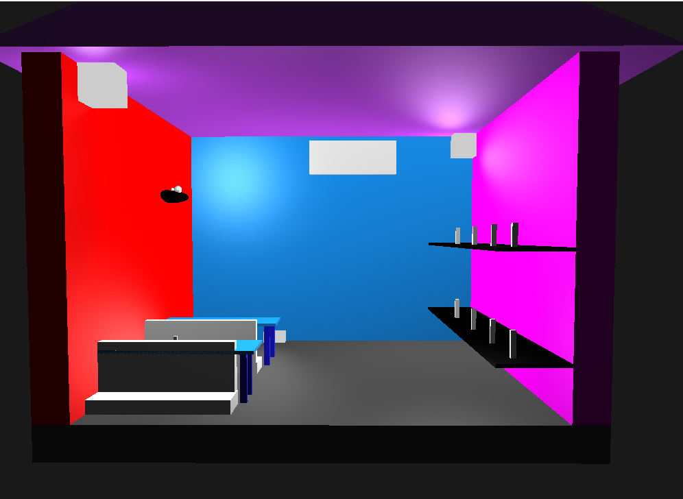

# 3D Restaurant Graphics Lab

This project is a 3D restaurant simulation developed using OpenGL and C++. The aim is to create a realistic and interactive restaurant environment.

## Features

- 3D rendering of restaurant interiors
- Interactive elements such as tables, chairs, and decorations
- Lighting and shading effects
- Camera controls for navigation

## Requirements

- OpenGL
- C++ compiler
- GLUT (OpenGL Utility Toolkit)

## Installation

1. Clone the repository:
    ```sh
    git clone https://github.com/kabirhiking/Graphics-Final-project-about-3D-Restaurant
    ```
2. Navigate to the project directory:
    ```sh
    cd 3d-restaurant-graphics-lab
    ```
3. Compile the project:
    ```sh
    g++ main.cpp -o restaurant -lGL -lGLU -lglut
    ```
4. Run the executable:
    ```sh
    ./restaurant
    ```

## Usage

- Use the arrow keys to navigate the camera.
- Press `W`, `A`, `S`, `D` to move forward, left, backward, and right respectively.
- Press `Q` and `E` to move up and down.

## Contributing

Contributions are welcome! Please fork the repository and submit a pull request.

